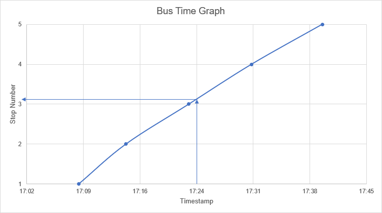
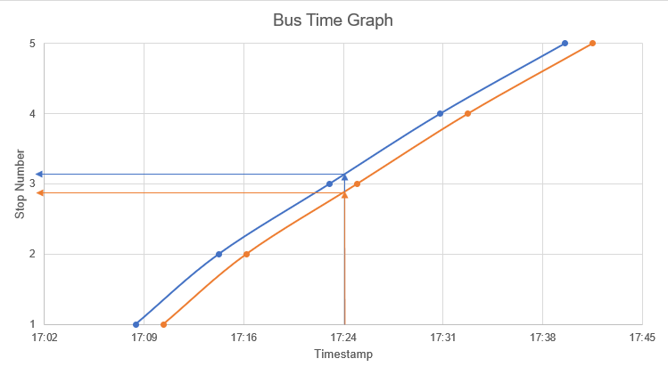

# Interpolation for estimation of realtime location

Assuming that current location information is not available but it is possible to both: get current delay information for service and get scheduled timetable information; the following idea is proposed to estimate current location of a bus.

## Linear interpolation of scheduled data

The exemplar timetable is as follows:

| Stop  | Time  |
| :---: | :---: |
|   1   | 17:09 |
|   2   | 17:15 |
|   3   | 17:23 |
|   4   | 17:31 |
|   5   | 17:40 |

This data can be represented graphically, as shown below. If we imagine that stop number has functionality with time (it does not matter at this point exactly what this function is), the current location can be read from the graph. Highlighted on the graph is the time 17:24, reading the graph, the current location is somewhere between stop 3 and 4. Although this information is not precise, the spacing between stops is usually short enough that this information is sufficient enough for the end user to appreciate the relative position of the bus.

## Expansion of concept to realtime data

If we have some expected time of arrival, in combination with our timetabled data, we can calculate an offset. Say if the bus is two minutes late at present, we can make an assumption that the timetable is shifted like:

| Stop  | Time  | Expected Time |
| :---: | :---: | :-----------: |
|   1   | 17:09 |     17:11     |
|   2   | 17:15 |     17:17     |
|   3   | 17:23 |     17:25     |
|   4   | 17:31 |     17:33     |
|   5   | 17:40 |     17:42     |

As previously, a graph can be drawn up showing this data. Reading the timetabled data at 17:24 is the same as previous. However, reading the realtime data (shown in orange), shows the position of the bus as somewhere between stop 2 and stop 3.

## Implementation of concept

In practice, it would be computationally intensive to generate perform this action, so the following schema is proposed, which follows the same principles, but does not use a graphical method. It does not return the "progress" along a certain leg of a route, (i.e. if the previous function returned 3.5, it could be assumed that it is halfway between stops 3 and 4), but this should still suffice.

- Load the timetable data and the current delay
- Shift the timetabled data by the delay if it sufficiently large
- Find the current time
- Find the time in the shifted timetable data that is closest to the current time but is not larger than it
- The current location is between the stop that satisfies the above condition and the stop proceeding it
